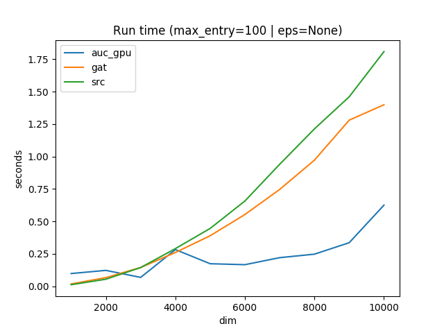
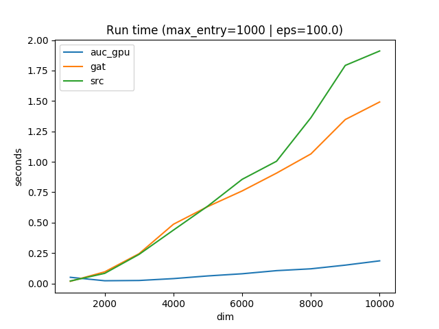
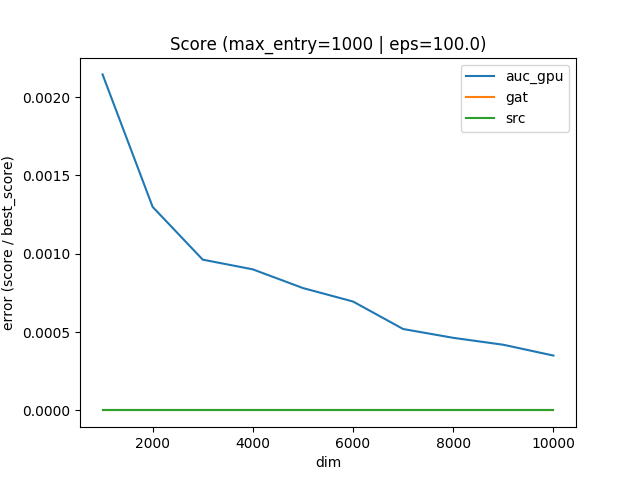

#### auction-lap

Linear Assignment Problem (LAP) solver using the auction algorithm.  Implemented in `pytorch`, runs on CPU or GPU.

Runtime scales w/
 - the dimension of the matrix
 - the range of entries in the matrix (max value - min value)

__Note:__ [cuda_auction](https://github.com/bkj/cuda_auction) is a lower-level CUDA implementation of the same algorithm.
__Note:__ [numba_auction](https://github.com/bkj/numba_auction) is a numba implementation of the same algorithm.

##### Installation

```
conda create -n auction_env python=3.6 pip
source activate auction_env
pip install -r requirements.txt
conda install pytorch==0.3.1 torchvision cuda91 -c pytorch -y
```

##### Usage

```
usage: benchmark.py [-h] [--max-entry MAX_ENTRY] [--min-dim MIN_DIM]
                    [--max-dim MAX_DIM] [--n-evals N_EVALS] [--eps EPS]
                    [--seed SEED]

optional arguments:
  -h, --help            show this help message and exit
  --max-entry MAX_ENTRY
                        maximum entry in matrix
  --min-dim MIN_DIM     minimum dimension matrix to test
  --max-dim MAX_DIM     maximum dimension matrix to test
  --n-evals N_EVALS     number of steps between min and max matrix size
  --eps EPS             "bid size" -- smaller values give better accuracy w/
                        longer runtime
  --seed SEED           random seed
```

See `./run.sh` for examples.

##### Results





##### To Do

 - Would this give any speedups?
    - https://github.com/rusty1s/pytorch_scatter
